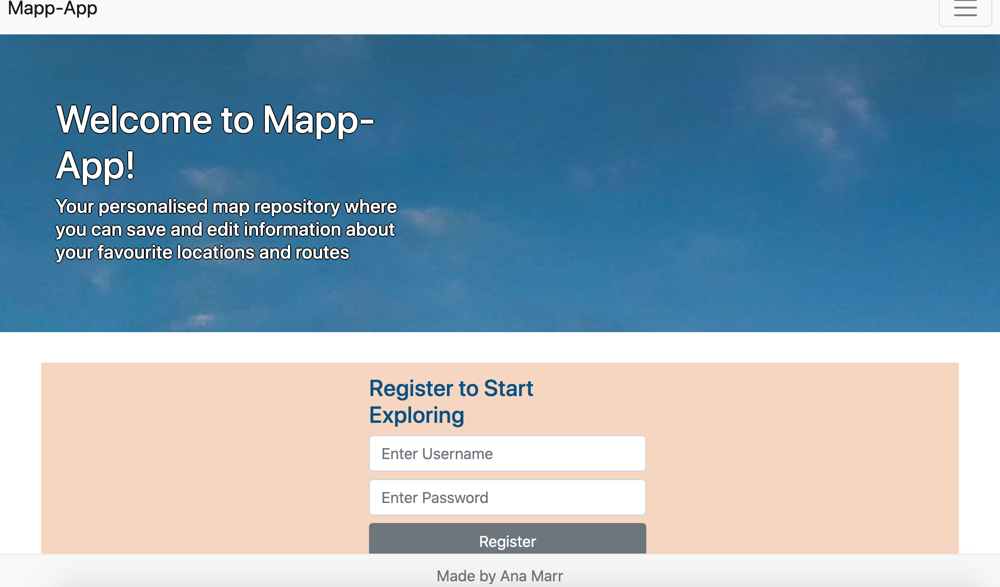
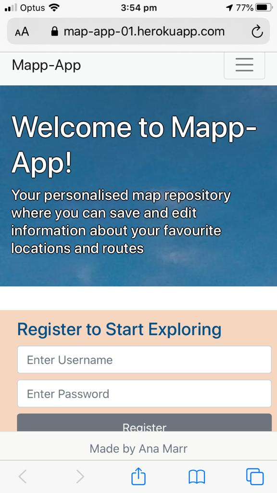

# Mapp-App

## Overview
A web application designed to provide users with an interactive map repository. It allows users to find a location, apply layers and have access to different routes. Additionally, the user can save the information retrieved in their own personalised repository.

## Usage
Upon loading of the web application the user will be invited to create an account by providing a username and password. After signing in they will have acces to an interative map which they can retrieve information from pre-existent plotted dots(divided by themes) or add their own points and routes in the map. 
The user can then save information in the map by clicking on the save button. This will generate a list of the clicked map information and be linked to the user. 

## Link to Deployed Application
[View here](https://map-app-01.herokuapp.com/)

### Desktop Screenshots

### Mobile Screenshots

## Credits
HTML & CSS, Javascript by Ana Marr 
ReactJS is the property of their creators/distributors and I claim no credit in their creation or distribution.
ArcGIS API is the property of their creators/distributors and I claim no credit in their creation or distribution.
Bootstrap is the property of their creators/distributors and I claim no credit in their creation or distribution.
Images are the property of their creators/distributors and I claim no credit in their creation or distribution.